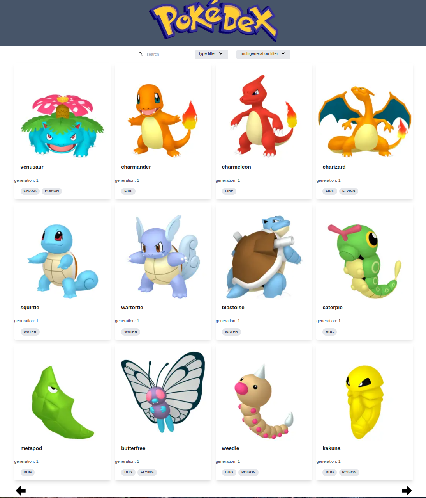

# Pokedex T3 stack

## How to run:

- Install dependencies with npm: `npm install`
- Start postgres server: `docker compose up -d`
- Run prisma schema migrations: `prisma migrate deploy`
- Run database fixture: `npm run data-migration:add-pokemon-details`
- Start development build by: `npm run dev`

